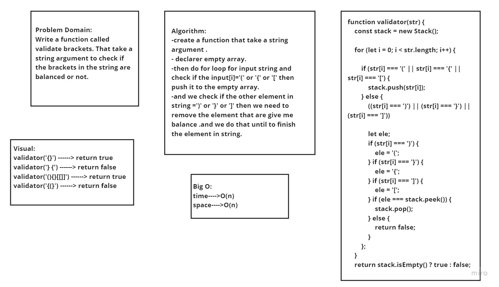

## Challenge 13:

### we create  a function called validate . That take a string argument to check if the brackets in the string are balanced or not. 

## Approach & Efficiency
  1. Understand the porblem.

  2. I try to imagined the ruslte.

  3. Drow the whitebord

  3. Writting the code

## Test:
 - npm run watch

 

  