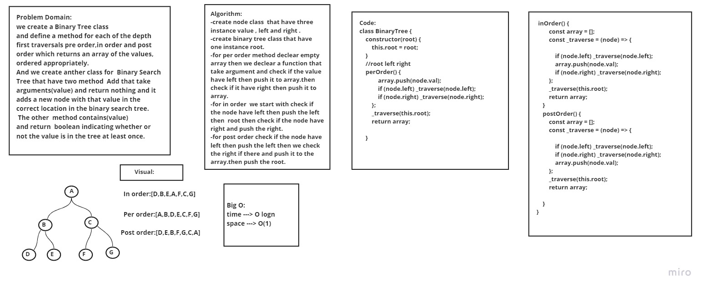
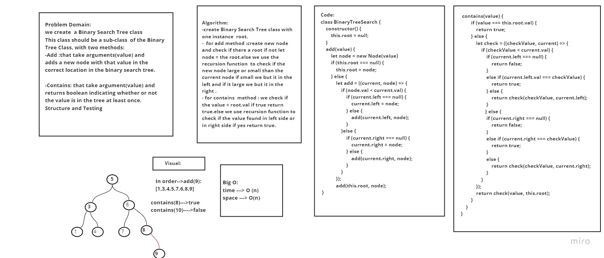
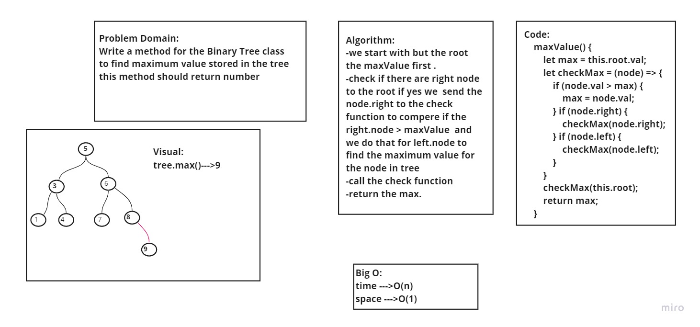
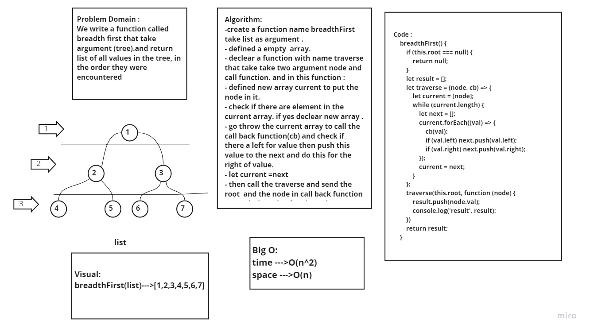

# Trees:
- A tree is a nonlinear data structure, compared to arrays, linked lists, stacks and queues which are linear data structures. A tree can be empty with no nodes or a tree is a structure consisting of one node called the root and zero or one or more subtrees.

## Challenge
### we create  a Binary Tree class with 3 method:
  - **pre order:** root-left-right 
  - **in order:**  left-root-right
  - **post order:** left-right-root

### we create  a Binary Tree Search class with 2 method:
  - **add (value) :** add new node to the tree in correct place.
  - **contains (value):**  check if the tree contain this value if yes return true.

## Approach & Efficiency
  1. Understand the porblem.

  2. I try to imagined the ruslte.

  3. Writting the code

## Test:
 - npm run watch

 ## Binary Tree :

   

 ## Binary Tree Search:

 

  

## MaxValue for Binary Trees:

## BreadthFirst (list)

