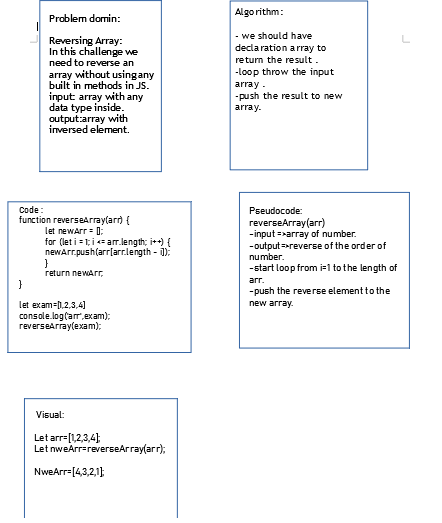

# Reverse Array:
### Write a function called reverseArray which takes an array as an argument. Without utilizing any of the built-in methods available to your language, return an array with elements in reversed order.

## Whiteboard:

## Approach and Efficiency:

1.Understand the porblem.

2.I try to solve the chalenge in replit.

3.Drawing whitboard.

4-It took one hour to complete the task.