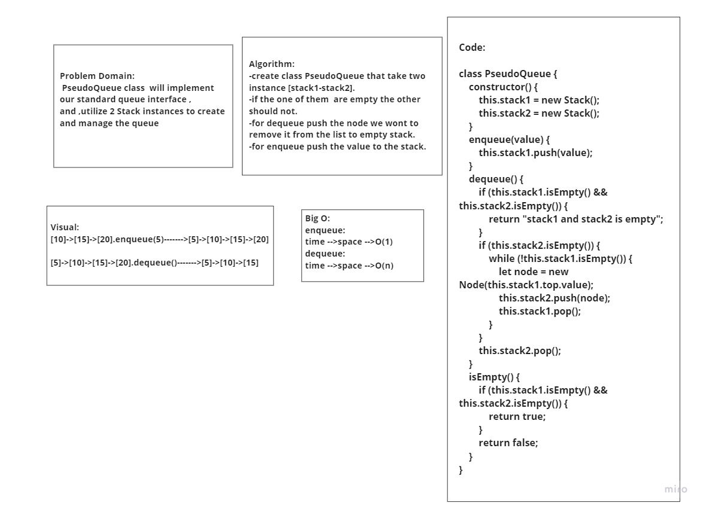
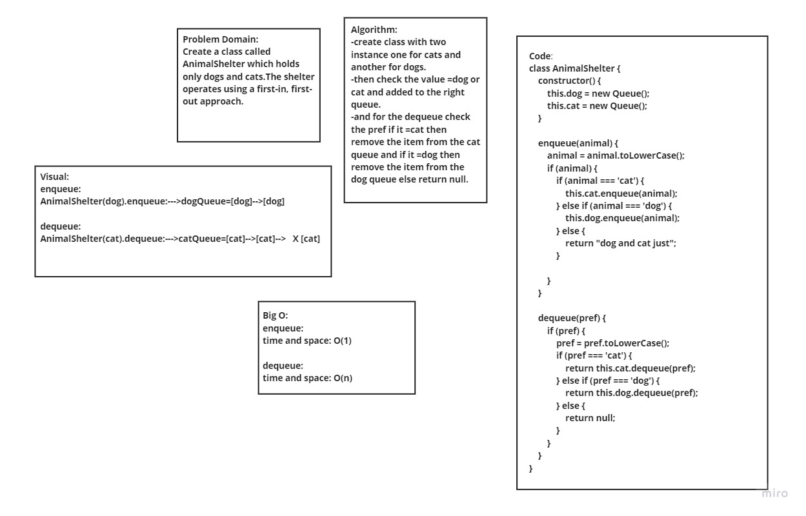

# Stacks and Queues
- A queue is a linear data structure in which elements can be inserted only from one side of the list called rear, and the elements can be deleted only from the other side called the front

- A stack is a linear data structure in which elements can be inserted and deleted only from one side of the list, called the top.

## Challenge
### we create stake class with 4 method:
 - **peek():** Returns the Value of the node located at the top of the stack
 - **push(ele):** adds a new node with that value to the top of the stack with an O(1) Time
 - **pop():** Removes the node from the top of the stack then returns the value from node from the top of the stack
 - **isEmpty():** Returns  boolean indicating whether or not the stack is empty.
Queue

### we create queue class with 4 method:
 - **peek():** Returns the Value of he node located at the front of the queue
 - **enqueue(value):** adds a new node with that value to the back of the queue with an O(1) Time performance.
 - **dequeue():** Removes the node from the front of the queue then returns the value from node from the front of the queue
 - **isEmpty():** Returns  boolean indicating indicating whether or not the queue is empty
Queue

## Approach & Efficiency
  1. Understand the porblem.

  2. I try to imagined the ruslte.

  3. Writting the code

## Test:
 - npm run watch

## PseudoQueue 
 

  

 
## AnimalShelter:

  
